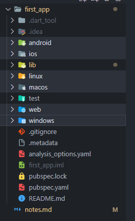
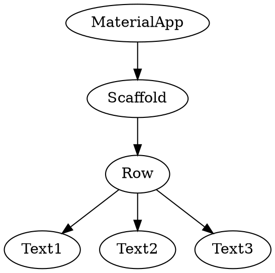
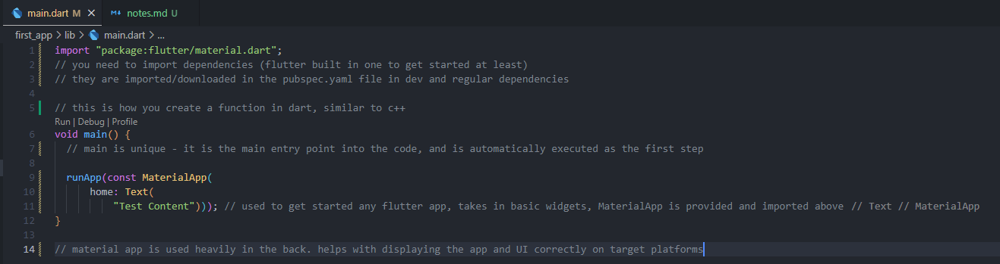
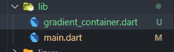
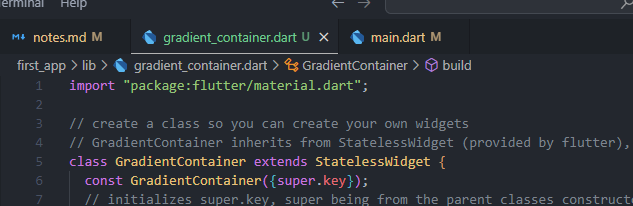
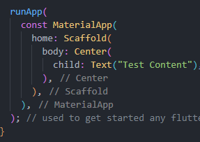

## installation guide

1. flutter sdk
   managing the flutter projects
   git version control

2. platform tools
   android studio - android apps
   xcode - ios apps

3. virtual devices
   android emulator
   ios emulator

---

## theory

#### main points

- beneficial as its one code base suitable for multiple platforms
- translation from "code" to target device is handled by flutter, translating to machine code needed
- dart is the language, flutter is the framework used on top of dart to create multi platform code

#### overview

Flutter uses Material app for its design - developed my Google to be used for flexible design
A set of suggestions and guidelines provided by Google to aid in app dev
Customizable and easy to extend on top of base code/ideas

#### notes

if you want to publish/release the app for a specific platform the files within the directory become relevant then i.e:


#

flutter apps become active by the following steps:

1. main() gets called automatically
2. runApp() is called automatically inside of main
3. the widget tree is passed into the run app

example widget tree:



flutter User Interfaces are created by nesting and combining widgets such as input boxes, buttons and custom created widgets

Scaffold is a class in flutter that is used to add widgets to. Occupies whole screen or the available space left. has default values, similar to a body tag in html

###### folders

build folder is also important, it contains files that flutter uses when creating the app and the output files for different platforms - auto managed by flutter
test folder is used to create automated tests, and attempting to catch errors. saves the effort of manually checking everything
lib is where the main coding is done
pubspec.yaml allows you to add 3rd party packages to code, used for when a feature do not exist in flutter/dart and you do not want to add it.

---

## syntax and code highlights

code is parsed from the top to the bottom of the script
it is translated to a language that is suitable to the target platform - compiled into native code for target platform
then the compiled code is executed on target platform



const helps to improve performance. it allows objects defined by const to be reused, improving memory efficiency and hence improving performance - that would be the crude explanation

dart is a type safe language, all values are a certain type such as string, int, MaterialType (as it is a class) etc, but it is not limited to one type per "object" i.e:

| value          | data type                   |
| -------------- | --------------------------- |
| "Hello world!" | string, object              |
| 29             | int, num, object            |
| MaterialApp    | MaterialApp, widget, object |

to add a basic and simple background color:

```dart
void main() {
  // main is unique - it is the main entry point into the code, and is automatically executed as the first step

  runApp(
    MaterialApp(
      // material app is used heavily in the back. helps with displaying the app and UI correctly on target platforms
      home: Scaffold(
         backgroundColor: Color.fromARGB(255, 255, 0, 0),
         body: Center(
            child: Text("Test Content"),
         ),
      ),
   ),
); // used to get started any flutter app, takes in basic widgets, MaterialApp is provided and imported above
}
```

if you want to use a container, you need to remove const as container does not support being a const, and by extension any parent widget cannot be defined as const, so you would need to declare it inside it.

for an advanced background with const re-declaration:

```dart
void main() {
  // main is unique - it is the main entry point into the code, and is automatically executed as the first step

  runApp(
    MaterialApp(
      // material app is used heavily in the back. helps with displaying the app and UI correctly on target platforms
      home: Scaffold(
        body: Container(
          decoration: const BoxDecoration(
            gradient: LinearGradient(
              colors: [
                Color.fromARGB(255, 255, 0, 0),
                Color.fromARGB(255, 255, 255, 0),
                Color.fromARGB(255, 0, 255, 0),
                Color.fromARGB(255, 0, 255, 255),
                Color.fromARGB(255, 0, 0, 255),
                Color.fromARGB(255, 255, 0, 255),
              ],
              begin: Alignment.topLeft,
              end: Alignment.bottomRight,
            ),
          ),
          child: const Center(
            child: Text("Test Content"),
          ),
        ),
      ),
    ),
  ); // used to get started any flutter app, takes in basic widgets, MaterialApp is provided and imported above
}
```

adding text styling:

```dart
body: Container(
          decoration: const BoxDecoration(
            gradient: LinearGradient(
              colors: [
                Color.fromARGB(255, 255, 0, 0),
                Color.fromARGB(255, 255, 255, 0),
                Color.fromARGB(255, 0, 255, 0),
                Color.fromARGB(255, 0, 255, 255),
                Color.fromARGB(255, 0, 0, 255),
                Color.fromARGB(255, 255, 0, 255),
              ],
              begin: Alignment.topLeft,
              end: Alignment.bottomRight,
            ),
          ),
          child: const Center(
            child: Text(
              "Test Content",
              style: TextStyle(
                backgroundColor: Color.fromARGB(255, 154, 173, 152),
                color: Color.fromARGB(255, 255, 255, 255),
              ),
            ),
          ),
        ),
```

better practice for creating and managing widgets is to isolate them, similar to how kiss and solid programming principles work. create a structure that is usable and consistent and keep it modular so it can be reused

to do this you would need to take a smaller section of the tree i.e. container, and break it up into smaller branches which leads to classes and custom widgets:

###### classes and custom widgets

classes are used to separate widget trees from the main code to make it modular. similar to solid and kiss programming principles. having one module for background allows you to use it in different apps, different pages of the same app, different containers within one page of the app etc.
makes it easier to access and manipulate the data and appearance as the code is present and can just be called as opposed to being rewritten and adapting

i.e. separating container for background from main:

```dart
import "package:flutter/material.dart";

void main() {
  runApp(
    const MaterialApp(
      home: Scaffold(
        body: GradientContainer(),
      ),
    ),
  );
}

// create a class so you can create your own widgets
// GradientContainer inherits from StatelessWidget (provided by flutter), forces you to follow the StatelessWidget class constraints
class GradientContainer extends StatelessWidget {
  const GradientContainer({super.key});

  @override // not required but makes it clear to override a method that is expected by StatelessWidget
  Widget build(context) {
    return Container(
      decoration: const BoxDecoration(
        gradient: LinearGradient(
          colors: [
            Color.fromARGB(255, 255, 0, 0),
            Color.fromARGB(255, 255, 255, 0),
            Color.fromARGB(255, 0, 255, 0),
            Color.fromARGB(255, 0, 255, 255),
            Color.fromARGB(255, 0, 0, 255),
            Color.fromARGB(255, 255, 0, 255),
          ],
          begin: Alignment.topLeft,
          end: Alignment.bottomRight,
        ),
      ),
      child: const Center(
        child: Text(
          "Test Content",
          style: TextStyle(
            backgroundColor: Color.fromARGB(255, 154, 173, 152),
            color: Color.fromARGB(255, 255, 255, 255),
          ),
        ),
      ),
    );
  } // Widget is the data type returned, context will receive context parameters (target), build is called automatically by flutter similar to main when rendering interface
}
```

an even better practice is to split up code across multiple files
makes it easier to manipulate and work on files as well as keeping the files lean

looking at file structure and imports:





---

## misc

use "R" in terminal that you used to launch flutter to reload the code into app i.e. changes to code such as a counter

select widget, right click and choose refactor, it gives you smart suggestions

add commas to the end of brackets and format document to get it auto commented to some extent and amended structure

