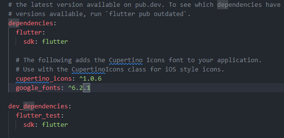

## installation guide

1. flutter sdk
   managing the flutter projects
   git version control

2. platform tools
   android studio - android apps
   xcode - ios apps

3. virtual devices
   android emulator
   ios emulator

---

## What is ---?

### Dart

Dart is a type safe, general purpose programming language. It is designed with fast/accelerated app building in mind for multiple platforms.

It is developed by Google as an alternative to JavaScript with its own virtual machine to run apps within the browser. It later got adopted by the flutter framework after its unsteady initial start.

It is unique in the way such that it can compile in multiple machine code languages for different platforms such as:

- arm and x64 machine code for mobile devices,
- javascript for browsers
- self contained executables for Windows, macOS, Linux systems

It has a Just-In-Time compiler so it gets compiled on the fly allowing for hot reloads and avoiding fully restarting the app.

All dart code runs inside an isolate; which is similar to a chunk of memory running in single thread loop, allowing it to perform asynchronous background work on a single thread, but it also allows you to spawn multiple isolates to run in parallel with each other benefitting from parallelism and multithreading.

Its type safe language - variable values matches its static type, however it is flexible so it permits the use of dynamic types and runtime checks when needed. It also has null safety, preventing variables to be inferred as null, unless stated otherwise.

Dart is not restricted to client-side usage. It can be used in conjunction with API's such as Aqueduct (being the most prominent one), Shelf, Angel and its own built in HTTP server (which is more restrictive than the aforementioned alternatives). Alternatively you can utilize the Angular framework, AngularDart; which can be seen as the Dart variant of React.js, used to create reactive and more advanced web applications. This allows Dart to be used in cases where a database might be needed with the implementation of suitable frameworks and API's

It is linked with a package manager called pub, which is open source and has an active community.

### Flutter

Flutter is a user interface (UI) framework that is designed for Android, iOS, browser and desktop platforms. The flutter engine is primarily C++ driven, providing low-level rendering support for Skia graphics (developed by Google, designed as an open source 2D graphics library) or a custom Impeller graphics, a graphics layer developed by Flutter to help optimize and provide additional features. It also interfaces (interacts and can utilize) with platform specific Software-Development-Kit's (Android and iOS) to allow the use of their own/unique features and attributes, such as I/O systems, sensors, file etc. It also has support for native plugins, allowing platform specific features to be utilized and integrated to the Flutter application without being directly supported by the Flutter engine itself.

Flutter has a similar logic to JavaScript DOM's (Document Object Model) in terms of creating a UI, but differ in their implementation. Flutter's Widget Trees use a hierarchical structure, where a series of widgets are put together to create a larger widget, a collection of larger widgets are then combined to create an even bigger widget and so on.

The widget tree is immutable, meaning it cannot be altered once it is created. If there is a state change the entire tree is reloaded. Whilst it may seem inefficient the Flutter/Dart framework is designed with this execution in place, hence it is optimized and is not as hindered as other solutions (DOM's) when reloading the tree. The algorithm (Flutter's reconciliation algorithm) that is used to reload the widget tree is designed to use minimal resources, keeping the overheads low. The Flutter widget tree is independent, meaning that the same codebase can be used for different platforms allowing one code to be compatible with multiple platforms.

There is an important library to mention, GetX. Whilst Flutter is optimized for reloading the entire widget tree, the GetX library takes it a step further and allows allows the widget tree to function more like a Virtual DOM. This means that instead of reloading the entire widget tree from scratch, similar to a regular DOM, it compares the current state and the "target" state, identifies the differences present and only changes the widgets that have been altered.

Flutter widgets have 2 main families: StatefulWidget's and StatelessWidget's.

Stateless widgets cannot be altered once they are created for the remainder of their life cycle. They override the build() method and then are defined to create the UI. Stateless widgets can get rebuilt when their parent widget is rebuild, as this creates a new instance of the sub-widget. They are suitable for displaying information, icons, buttons and similar UI components that are not expected to change, or their changes are dependant on the parent, which would cause them to be rebuilt with the new content anyway

Stateful widgets can be altered and manipulated once they are built, meaning that they are in a mutable state. They can dynamically respond to changes in data, conditions and inputs. They have a dedicated method that is used to change their state "setState()". They are traditionally used in scenarios where they actively undergo change and may be interacted with, such as displaying live data and handling dynamic user inputs (slider bars, counters etc.)

The Flutter/Dart framework is designed to be very efficient to allow the development of applications fast. There are multiple features such as easy refactoring options that can be used to encapsulate existing widgets and perform hot reloads which prevent the developer needing to reload an entire app, but rather execute a hot reload. Hot reload allows the app to preserve its state when there is a code update going on, meaning that the navigation stack, inputs and data passed in, etc are all still present. It is responsive and allows changes made to the code be seen immediately once the reload is completed.

## theory

#### main points

- beneficial as its one code base suitable for multiple platforms
- translation from "code" to target device is handled by flutter, translating to machine code needed
- dart is the language, flutter is the framework used on top of dart to create multi platform code

#### overview

Flutter uses Material app for its design - developed my Google to be used for flexible design
A set of suggestions and guidelines provided by Google to aid in app dev
Customizable and easy to extend on top of base code/ideas

####

if you want to publish/release the app for a specific platform the files within the directory become relevant then i.e:


flutter apps become active by the following steps:

1. main() gets called automatically
2. runApp() is called automatically inside of main
3. the widget tree is passed into the run app

example widget tree:


flutter User Interfaces are created by nesting and combining widgets such as input boxes, buttons and custom created widgets

Scaffold is a class in flutter that is used to add widgets to. Occupies whole screen or the available space left. has default values, similar to a body tag in html

###### folders

build folder is also important, it contains files that flutter uses when creating the app and the output files for different platforms - auto managed by flutter
test folder is used to create automated tests, and attempting to catch errors. saves the effort of manually checking everything
lib is where the main coding is done
pubspec.yaml allows you to add 3rd party packages to code, used for when a feature do not exist in flutter/dart and you do not want to add it.

---

## syntax and code highlights

code is parsed from the top to the bottom of the script
it is translated to a language that is suitable to the target platform - compiled into native code for target platform
then the compiled code is executed on target platform


const helps to improve performance. it allows objects defined by const to be reused, improving memory efficiency and hence improving performance - that would be the crude explanation

dart is a type safe language, all values are a certain type such as string, int, MaterialType (as it is a class) etc, but it is not limited to one type per "object" i.e:

| value          | data type                   |
| -------------- | --------------------------- |
| "Hello world!" | string, object              |
| 29             | int, num, object            |
| MaterialApp    | MaterialApp, widget, object |

###### styling

to add a basic and simple background color:

```dart
void main() {
  // main is unique - it is the main entry point into the code, and is automatically executed as the first step

  runApp(
    MaterialApp(
      // material app is used heavily in the back. helps with displaying the app and UI correctly on target platforms
      home: Scaffold(
         backgroundColor: Color.fromARGB(255, 255, 0, 0),
         body: Center(
            child: Text("Test Content"),
         ),
      ),
   ),
); // used to get started any flutter app, takes in basic widgets, MaterialApp is provided and imported above
}
```

if you want to use a container, you need to remove const as container does not support being a const, and by extension any parent widget cannot be defined as const, so you would need to declare it inside it.

for an advanced background with const re-declaration:

```dart
void main() {
  // main is unique - it is the main entry point into the code, and is automatically executed as the first step

  runApp(
    MaterialApp(
      // material app is used heavily in the back. helps with displaying the app and UI correctly on target platforms
      home: Scaffold(
        body: Container(
          decoration: const BoxDecoration(
            gradient: LinearGradient(
              colors: [
                Color.fromARGB(255, 255, 0, 0),
                Color.fromARGB(255, 255, 255, 0),
                Color.fromARGB(255, 0, 255, 0),
                Color.fromARGB(255, 0, 255, 255),
                Color.fromARGB(255, 0, 0, 255),
                Color.fromARGB(255, 255, 0, 255),
              ],
              begin: Alignment.topLeft,
              end: Alignment.bottomRight,
            ),
          ),
          child: const Center(
            child: Text("Test Content"),
          ),
        ),
      ),
    ),
  ); // used to get started any flutter app, takes in basic widgets, MaterialApp is provided and imported above
}
```

adding text styling:

```dart
body: Container(
          decoration: const BoxDecoration(
            gradient: LinearGradient(
              colors: [
                Color.fromARGB(255, 255, 0, 0),
                Color.fromARGB(255, 255, 255, 0),
                Color.fromARGB(255, 0, 255, 0),
                Color.fromARGB(255, 0, 255, 255),
                Color.fromARGB(255, 0, 0, 255),
                Color.fromARGB(255, 255, 0, 255),
              ],
              begin: Alignment.topLeft,
              end: Alignment.bottomRight,
            ),
          ),
          child: const Center(
            child: Text(
              "Test Content",
              style: TextStyle(
                backgroundColor: Color.fromARGB(255, 154, 173, 152),
                color: Color.fromARGB(255, 255, 255, 255),
              ),
            ),
          ),
        ),
```

better practice for creating and managing widgets is to isolate them, similar to how kiss and solid programming principles work. create a structure that is usable and consistent and keep it modular so it can be reused

to do this you would need to take a smaller section of the tree i.e. container, and break it up into smaller branches which leads to classes and custom widgets:

---

for instances where you have a set height, and want content to be scrollable if it exceeds it:

```dart
  @override
  Widget build(BuildContext context) {
    return SizedBox(
      height: 300, // sets a height of 300 for this widget
      // height: MediaQuery.of(context).size.height * 0.6,
      child: SingleChildScrollView( // allows the children of this widget to be scrollable
        child: Column(
          // children go in here
        )
      )
    )
  }
```

###### classes and custom widgets

classes are used to separate widget trees from the main code to make it modular. similar to solid and kiss programming principles. having one module for background allows you to use it in different apps, different pages of the same app, different containers within one page of the app etc.
makes it easier to access and manipulate the data and appearance as the code is present and can just be called as opposed to being rewritten and adapting

i.e. separating container for background from main:

```dart
import "package:flutter/material.dart";

void main() {
  runApp(
    const MaterialApp(
      home: Scaffold(
        body: GradientContainer(),
      ),
    ),
  );
}

// create a class so you can create your own widgets
// GradientContainer inherits from StatelessWidget (provided by flutter), forces you to follow the StatelessWidget class constraints
class GradientContainer extends StatelessWidget {
  const GradientContainer({super.key});

  @override // not required but makes it clear to override a method that is expected by StatelessWidget
  Widget build(context) {
    return Container(
      decoration: const BoxDecoration(
        gradient: LinearGradient(
          colors: [
            Color.fromARGB(255, 255, 0, 0),
            Color.fromARGB(255, 255, 255, 0),
            Color.fromARGB(255, 0, 255, 0),
            Color.fromARGB(255, 0, 255, 255),
            Color.fromARGB(255, 0, 0, 255),
            Color.fromARGB(255, 255, 0, 255),
          ],
          begin: Alignment.topLeft,
          end: Alignment.bottomRight,
        ),
      ),
      child: const Center(
        child: Text(
          "Test Content",
          style: TextStyle(
            backgroundColor: Color.fromARGB(255, 154, 173, 152),
            color: Color.fromARGB(255, 255, 255, 255),
          ),
        ),
      ),
    );
  } // Widget is the data type returned, context will receive context parameters (target), build is called automatically by flutter similar to main when rendering interface
}
```

an even better practice is to split up code across multiple files
makes it easier to manipulate and work on files as well as keeping the files lean

looking at file structure and imports:


###### variables

use final to restrict the value of variables, or const to prevent interference
const is compile time variable so it prevents it from being assigned later
final is more suitable for when there is a value that will come for it later on, i.e. final startAlignment = calcDeviceScreen(),
this allows it to be assigned a final value after it is passed in a value instead of being restricted from compile
final startAlignment = Alignment.topLeft;
final endAlignment = Alignment.bottomRight;

```dart
// suitable for changing variables
var startAlignment = Alignment.topLeft;
var endAlignment = Alignment.bottomRight;

// for variables/values that are defined and wont change at run time
const startAlignment = Alignment.topLeft;
const endAlignment = Alignment.bottomRight;

// for variables that should not be changing but will get their assignments after run time
final startAlignment = Alignment.topLeft;
final endAlignment = Alignment.bottomRight;
```

when passing variables from file to file/method to method, you need to make it such that the target method has a constructor able to accept the parameter being passed in:

also uses this.var1 to help declare a positional class variables and their assignment, use case and example final declaration for a string variable

```dart
class StyledText extends StatelessWidget {
  StyledText(this.displayText, {super.key});
  // this is the positional argument approach
  // this.displayText allows you to make the parameter being passed available as a class variable
  // however even if you leave it as just String displayText, flutter automatically looks for class variables based on the variable name
  // and assigns them automatically
  // it can no longer be a const as it has a value being passed into it which means it can change

  final String displayText;
  // as you do not plan on reassigning the variables, you can specify the type as final String

  @override
  Widget build(context) {
    // it can no longer be returning a const Text
    // as it has a value being passed into it which means it can change
    return Text(
      displayText,
      // so the new const is the style
      style: const TextStyle(
        backgroundColor: Color.fromARGB(255, 154, 173, 152),
        color: Color.fromARGB(255, 255, 255, 255),
      ),
    );
  }
}

```

and for a name variable approach:

```dart
// gradient_container
import "package:flutter/material.dart";
import "package:first_app/styled_text.dart";

const startAlignment = Alignment.topLeft;
const endAlignment = Alignment.bottomRight;

// create a class so you can create your own widgets
// GradientContainer inherits from StatelessWidget (provided by flutter), forces you to follow the StatelessWidget class constraints
class GradientContainer extends StatelessWidget {
  const GradientContainer({super.key, required this.colorList});
  // names arguments are optional
  // fix it by using required this.colorList
  // initializes super.key, super being from the parent classes constructor function
  // as GradientContainer is not an object that is expected to change, it can be defined as a constant value/type

  final List<Color> colorList;

  @override // not required but makes it clear to override a method that is expected by StatelessWidget
  Widget build(context) {
    return Container(
      decoration: BoxDecoration(
        gradient: LinearGradient(
          colors: colorList,
          begin: startAlignment,
          end: endAlignment,
        ),
      ),
      child: const Center(
        child: StyledText("test"),
      ),
    );
  } // Widget is the data type returned, context will receive context parameters (target), build is called automatically by flutter similar to main when rendering interface
}

```

this is what the initial main file can be reduced to, by taking out different widgets out and making them modular,

also contains an example of a declaration of a list outside the main func and then how it is used to pass in a value to a different widget

```dart
// main.dart
import "package:flutter/material.dart";
import "package:first_app/gradient_container.dart";
// you need to import dependencies (flutter built in one to get started at least)
// they are imported/downloaded in the pubspec.yaml file in dev and regular dependencies

const List<Color> colorList = [
  Color.fromARGB(255, 255, 0, 0),
  Color.fromARGB(255, 255, 255, 0),
  Color.fromARGB(255, 0, 255, 0),
  Color.fromARGB(255, 0, 255, 255),
  Color.fromARGB(255, 0, 0, 255),
  Color.fromARGB(255, 255, 0, 255),
];

// this is how you create a function in dart, similar to c++
void main() {
  // main is unique - it is the main entry point into the code, and is automatically executed as the first step

  runApp(
    const MaterialApp(
      // material app is used heavily in the back. helps with displaying the app and UI correctly on target platforms
      home: Scaffold(
        body: GradientContainer(
          colorList: colorList,
        ),
      ),
    ),
  ); // used to get started any flutter app, takes in basic widgets, MaterialApp is provided and imported above
}
```

###### classes and custom widgets 2

there can be multiple constructors within a class, with its own respective properties such as:

simple main.dart file

```dart
import "package:flutter/material.dart";
import "package:first_app/gradient_container.dart";

void main() {
  runApp(
    const MaterialApp(
      home: Scaffold(
        // body: GradientContainer.red(),
        // body: GradientContainer.green(),
        body: GradientContainer.blue(),
      ),
    ),
  );
}

```

and the relevant gradient file:

```dart
import "package:flutter/material.dart";
import "package:first_app/styled_text.dart";

const startAlignment = Alignment.topLeft;
const endAlignment = Alignment.bottomRight;

class GradientContainer extends StatelessWidget {
  const GradientContainer(this.color1, this.color2, this.color3, this.color4,
      this.color5, this.color6,
      {super.key});

// uses constructor classes with set values to make it easier to specify the background we want
  const GradientContainer.red({super.key})
      : color1 = const Color.fromARGB(255, 179, 0, 0),
        color2 = const Color.fromARGB(255, 204, 0, 0),
        color3 = const Color.fromARGB(255, 230, 0, 0),
        color4 = const Color.fromARGB(255, 255, 0, 0),
        color5 = const Color.fromARGB(255, 255, 26, 26),
        color6 = const Color.fromARGB(255, 255, 51, 51);

  const GradientContainer.green({super.key})
      : color1 = const Color.fromARGB(255, 0, 179, 0),
        color2 = const Color.fromARGB(255, 0, 204, 0),
        color3 = const Color.fromARGB(255, 0, 230, 0),
        color4 = const Color.fromARGB(255, 0, 255, 0),
        color5 = const Color.fromARGB(255, 26, 255, 26),
        color6 = const Color.fromARGB(255, 51, 255, 51);

  const GradientContainer.blue({super.key})
      : color1 = const Color.fromARGB(255, 0, 0, 179),
        color2 = const Color.fromARGB(255, 0, 0, 204),
        color3 = const Color.fromARGB(255, 0, 0, 230),
        color4 = const Color.fromARGB(255, 0, 0, 255),
        color5 = const Color.fromARGB(255, 26, 26, 255),
        color6 = const Color.fromARGB(255, 51, 51, 255);

  final Color color1;
  final Color color2;
  final Color color3;
  final Color color4;
  final Color color5;
  final Color color6;

  @override
  Widget build(context) {
    return Container(
      decoration: BoxDecoration(
        gradient: LinearGradient(
          colors: [color1, color2, color3, color4, color5, color6],
          begin: startAlignment,
          end: endAlignment,
        ),
      ),
      child: const Center(
        child: StyledText("test"),
      ),
    );
  }
}

```

depending on what the user chooses from main.dart as their GradientContainer.<color>, the gradient will be set based on the values of color from the appropriate options of the multiple constructors present within the gradient class

###### adding assets

to add assets you would ideally create a new folder within project folder called assets, since we are using images, another subfolder called images


inside the pubspec.yaml file, there is a section that looks like this:


change it to target your image assets:


specify their path, and with the correct vs extension you should even be able to see a preview of the image

how to add an image, and ratio the size based on screen dimensions:

```dart
  @override
  Widget build(context) {
    return Container(
      decoration: BoxDecoration(
        gradient: LinearGradient(
          colors: colorList,
          begin: startAlignment,
          end: endAlignment,
        ),
      ),
      child: Center(
        child: SizedBox(
          width: MediaQuery.of(context).size.width * 0.5, // 50% of screen width
          height:
              MediaQuery.of(context).size.height * 0.5, // 50% of screen height
          child: Image.asset("assets/images/dice-2.png"),
        ),
      ),
    );
  }
```

###### buttons and actions

```dart
//different types of generic flutter buttons that are built in:

  ElevatedButton(onPressed: onPressed, child: child), // button with background and shadow

  OutlinedButton(onPressed: onPressed, child: child), // no background but yes border

  TextButton(onPressed: onPressed, child: child), // pressable text only
```

onPressed wants a function to call upon button trigger or null
child wants another widget that is wrapped inside the button, such as a text widget

```dart
// different ways to handle onPressed
// method 1 - create an anonymous function
ElevatedButton(onPressed: () {
  // code goes in here for the anonymous function
}, child: const Text("Roll the die!"))

//method 2 - create a regular function
void randomFunction (){
  // code here
};

// other code

ElevatedButton(onPressed: randomFunction, child: const Text("Roll the die!"))
```

depending on what the button action does, especially if you execute a change that is requiring a reload of a widget, you need to look at StatefulWidget

###### StatefulWidget and StatelessWidget

a stateless widget is used when the values are defined, images and parameters are known, when not many active changes need to be made. it is loaded and then left as it is

however if there is a state change, such as rolling a new dice when a button is triggered, you need to use StatefulWidget to be able to reload the relevant widget tree and components

the logic behind a stateful widget is it is broken up into 2 sections

an example regarding it being implemented would be:

```dart
// dice_roller.dart
import 'package:flutter/material.dart';

// creates the StatefulWidget class for DiceRoller
class DiceRoller extends StatefulWidget {
  const DiceRoller({super.key});

  @override
  State<DiceRoller> createState() { // it creates the initial state to be shown
    return _DiceRollerState(); // calls the private _DiceRollerState function
  }
}

class _DiceRollerState extends State<DiceRoller> { // this is where the State of the widget is set
  var activeDiceFace = "assets/images/dice-2.png"; // default state

  void rollDice() {
    setState(() { // the actual state changing function - uses an anonymous function to do this within rollDice function (which is the function that is called from the button)
      activeDiceFace = "assets/images/dice-4.png"; // reassignment
    });
  }

  @override
  Widget build(context) {
    return Column(
      mainAxisSize: MainAxisSize
          .min, // forces the column height to be the minimum required (helps with vertical centering)
      children: [
        SizedBox(
          width: MediaQuery.of(context).size.width * 0.5, // 50% of screen width
          height:
              MediaQuery.of(context).size.height * 0.5, // 50% of screen height
          child: Image.asset(activeDiceFace),
        ),
        ElevatedButton( // button with different styling options, padding, text color, 50/255 opacity, font size
            onPressed: rollDice, // calls the function
            style: TextButton.styleFrom(
              padding: const EdgeInsets.all(20),
              foregroundColor: Colors.white,
              backgroundColor: const Color.fromARGB(50, 0, 0, 0),
              textStyle: const TextStyle(fontSize: 20),
            ),
            child: const Text("Roll the die!")),
      ],
    );
  }
}


// gradient_container.dart - file that has the button widget
import "package:flutter/material.dart";
import "package:first_app/dice_roller.dart";

const startAlignment = Alignment.topLeft;
const endAlignment = Alignment.bottomRight;

class GradientContainer extends StatelessWidget {
  const GradientContainer({super.key, required this.colorList});

  final List<Color> colorList;

  @override
  Widget build(context) {
    return Container(
      decoration: BoxDecoration(
        gradient: LinearGradient(
          colors: colorList,
          begin: startAlignment,
          end: endAlignment,
        ),
      ),
      child: const Center(
        child: DiceRoller(), // calling the button widget to exist
      ),
    );
  }
}

```

There is an additional button style from flutter widgets:
It is a generic button with an outline similar to elevated button

```dart
 OutlinedButton(
            onPressed: () {},
            style: OutlinedButton.styleFrom(
              padding: const EdgeInsets.all(20),
              foregroundColor: Colors.white,
              backgroundColor: const Color.fromARGB(50, 0, 0, 0),
              textStyle: const TextStyle(fontSize: 20),
            ),
            child: const Text("Start Quiz"),
          )
```

##### Advanced widgets:

You can add little icons to widgets and buttons:
for a button:

```dart
OutlinedButton.icon(
  onPressed: () {},
  style: OutlinedButton.styleFrom(
    padding: const EdgeInsets.all(15),
    foregroundColor: Colors.white,
    backgroundColor: const Color.fromARGB(50, 0, 0, 0),
    textStyle: const TextStyle(fontSize: 15),
  ),
  icon: const Icon(Icons
      .arrow_right), // when using an icon in a button, you need to provide an icon widget
  label: const Text("Start Quiz") // and you replace child with label
)
```

You can also toggle the visibility/opacity of a widget, however it is resource intensive and should be avoided where possible

```dart
 Widget build(context) {
    return Center(
      child: Column(
        mainAxisSize: MainAxisSize.min,
        children: [
          Opacity(
            opacity: 0.5,
            child: Image.asset("assets/images/quiz-logo.png",
                width: MediaQuery.of(context).size.width * 0.5,
                height: MediaQuery.of(context).size.height * 0.5),
)]))}
```

however to avoid that resource intense steps, an alternative is to use argb color styling to manipulate the transparency:

```dart
          Image.asset(
            "assets/images/quiz-logo.png",
            width: MediaQuery.of(context).size.width * 0.5,
            height: MediaQuery.of(context).size.height * 0.5,
            color: const Color.fromARGB(150, 255, 255, 255),
          ),
```

##### rendering content conditionally

you can set widgets to be contained within a variable such that it can be assigned and called and changed

```dart
class _QuizState extends State<Quiz> {
  // you can store widgets in variables as widgets are technically a data type and a value - you cannot use var as its restrictive due to the class properties not being identical, hence you need to use widget to keep the variable less restrictive

  Widget activeScreen = const StartScreen(
      switchScreen); // passes a pointer to link with switchScreen - avoid using brackets as that will call it which is not the intention


  void switchScreen() {
    setState(() {
      activeScreen = const QuestionScreen();
    });
  }
 // this anonymous function executes and changes that are meant to be displayed in the user interface

  @override
  Widget build(context) {
    return MaterialApp(
      home: Scaffold(
        body: Container(
          decoration: const BoxDecoration(
            // using const here as all the widgets and values contained within fall under the constant type
            gradient: LinearGradient(
              colors: [
                Color.fromARGB(255, 78, 13, 151),
                Color.fromARGB(255, 107, 15, 168),
              ],
              begin: Alignment.topLeft,
              end: Alignment.bottomRight,
            ),
          ),
          child:
              activeScreen, // StartScreen uses center to force the child to use all available space
        ),
      ),
    );
  }
}
```

example of rendering conditionally - full code

```dart
// quiz.dart

import "package:flutter/material.dart";
import "package:quiz_app/question_screen.dart";
import "package:quiz_app/start_screen.dart";

class Quiz extends StatefulWidget {
  const Quiz({super.key});

  @override
  State<Quiz> createState() {
    return _QuizState();
  }
}

class _QuizState extends State<Quiz> {
  Widget? activeScreen;
// using a question mark means the variable is present but it could take in a null value

// passes a pointer to link with switchScreen - avoid using brackets as that will call it which is not the intention
  // normally you would get an error here as you are trying to use switchScreen without declaring/initializing it which is why you need to create a dedicated initialization method

  // need to create an initialization method to prevent functions and assignments occurring too early.
  // it is only executed once and is never done again
  @override
  void initState() {
    activeScreen = StartScreen(switchScreen);
    super.initState();
  }

// too many arguments being passed into start screen ^^ if it is not accounted for like below
// that needs to be changed on start_screen.dart
// you can add either a positional or name argument in the constructor class and specify the class
// i.e: from

// class StartScreen extends StatelessWidget {
//    const StartScreen({super.key});

// to:

// class StartScreen extends StatelessWidget {
//    const StartScreen(void Function() startQuiz, {super.key});

// or using darts built in type recognition

// class StartScreen extends StatelessWidget {
//    const StartScreen(this.startQuiz, {super.key});

// this means that startQuiz is declared as a function type, which is built into dart
// the startQuiz is a function that doesn't return a value or takes in a value, which matches what the actual function does within quiz.dart

  void switchScreen() {
    setState(() {
      activeScreen = const QuestionScreen();
    });
  }

  @override
  Widget build(context) {
    return MaterialApp(
      home: Scaffold(
        body: Container(
          decoration: const BoxDecoration(
            // using const here as all the widgets and values contained within fall under the constant type
            gradient: LinearGradient(
              colors: [
                Color.fromARGB(255, 78, 13, 151),
                Color.fromARGB(255, 107, 15, 168),
              ],
              begin: Alignment.topLeft,
              end: Alignment.bottomRight,
            ),
          ),
          child:
              activeScreen, // StartScreen uses center to force the child to use all available space
        ),
      ),
    );
  }
}

```

and where it is called - start_screen.dart:

```dart
// start_screen.dart
import "package:flutter/material.dart";

// creating a start screen widget as it is the norm to keep widgets and components that are not universal separate from the main
class StartScreen extends StatelessWidget {
  const StartScreen(this.startQuiz, {super.key});

  // need to declare the variable startQuiz, can be final as it only needs to be set once when the widget/function is called
  final void Function() startQuiz;

  @override
  Widget build(context) {
    return Center(
      child: Column(
        mainAxisSize: MainAxisSize.min,
        children: [
          // Opacity(
          //   opacity: 0.5,
          //   child: Image.asset("assets/images/quiz-logo.png",
          //       width: MediaQuery.of(context).size.width * 0.5,
          //       height: MediaQuery.of(context).size.height * 0.5),
          // ),
          Image.asset(
            "assets/images/quiz-logo.png",
            width: MediaQuery.of(context).size.width * 0.5,
            height: MediaQuery.of(context).size.height * 0.5,
            color: const Color.fromARGB(150, 255, 255, 255),
          ),

          const SizedBox(
            height: 80,
          ),
          const Text(
            "Learn Flutter the fun way!",
            style: TextStyle(
              color: Colors.white,
              fontSize: 20,
            ),
          ),
          const SizedBox(
            height: 30,
          ),
          OutlinedButton.icon(
            // onPressed: () { // anon function
            //   startQuiz();
            // },
            onPressed: startQuiz, // pointer method
            style: OutlinedButton.styleFrom(
              padding: const EdgeInsets.all(15),
              foregroundColor: Colors.white,
              backgroundColor: const Color.fromARGB(50, 0, 0, 0),
              textStyle: const TextStyle(fontSize: 15),
            ),
            icon: const Icon(Icons
                .arrow_right_alt), // when using an icon in a button, you need to provide an icon widget
            label: const Text("Start Quiz"), // and you replace child with label
          )
        ],
      ),
    );
  }
}

```

using variables is one way of rendering widgets conditionally but not the only way

##### lifting states

lifting states goes hand in hand with rendering content and in our case from above, rendering content conditionally.

annotations on code have been done to explain what is going on and where it is going on.

you may need to create initialization methods to help order and manage the function calls and assignments best scene in quiz.dart


you can use ternary expressions within a child to check a condition
a ternary expression in dart and other languages is a feature/concept, which allows you to check a condition and yield a value if a condition is met and yield another value if it is not met

an example:

```dart
class _QuizState extends State<Quiz> {
  var activeScreen = "start-screen"; // mapping active screen to a string

  void switchScreen() {
    setState(() {
      activeScreen =
          "question-screen"; // mapping the new active screen to question screen, its easier to read and digest as a human
    });
  }

  @override
  Widget build(context) {
    return MaterialApp(
      home: Scaffold(
        body: Container(
          decoration: const BoxDecoration(
            gradient: LinearGradient(
              colors: [
                Color.fromARGB(255, 78, 13, 151),
                Color.fromARGB(255, 107, 15, 168),
              ],
              begin: Alignment.topLeft,
              end: Alignment.bottomRight,
            ),
          ),
          child: activeScreen == "start-screen"
              ? StartScreen(switchScreen)
              : const QuestionScreen(),
          // yields true (bool value) if activeScreen is equal to "start-screen", it checks if a condition is met
        ),
      ),
    );
  }
}
```

example usage/breakdown is:

```dart
          child: activeScreen == "start-screen" // <-- the condition to check for
          // after the question mark the actions
              ? StartScreen(switchScreen) // <-- if true StartScreen(switchScreen)
              : const QuestionScreen(), // <-- if false, QuestionScreen pointer is called
```

and the result of the condition check is passed into the child argument, if true StartScreen(switchScreen) is passed into child, if false QuestionScreen() pointer is passed which uses the QuestionScreen widget/page

the benefit of using ternary expressions is that it does not require initializing with how its done

an alternative to ternary expressions being embedded into the child directly, you can declare and manipulate the widget that is passed into it by moving the ternary statement to the start of the widget

```dart

Class _QuizState extends State<Quiz> {
  var activeScreen = "start-screen"; // mapping active screen to a string

  void switchScreen() {
    setState(() {
      activeScreen =
          "question-screen"; // mapping the new active screen to question screen, its easier to read and digest as a human
    });
  }

  @override
  Widget build(context) {
    final screenWidget = activeScreen == "start-screen" // <-- creating a final variable as it only is meant to be declared/change once
        ? StartScreen(switchScreen)
        : const QuestionScreen();
    // the conditions work the same as the aforementioned ternary statement

    return MaterialApp(
      home: Scaffold(
        body: Container(
          decoration: const BoxDecoration(
            gradient: LinearGradient(
              colors: [
                Color.fromARGB(255, 78, 13, 151),
                Color.fromARGB(255, 107, 15, 168),
              ],
              begin: Alignment.topLeft,
              end: Alignment.bottomRight,
            ),
          ),
          child: screenWidget,
        ),
      ),
    );
  }
}

```

you can use if statements for checking conditions if you want to avoid the variable method and different variations of ternary statements.

```dart
class _QuizState extends State<Quiz> {
  var activeScreen = "start-screen"; // mapping active screen to a string

  void switchScreen() {
    setState(() {
      activeScreen =
          "question-screen"; // mapping the new active screen to question screen, its easier to read and digest as a human
    });
  }

  @override
  Widget build(context) {
    Widget screenWidget = StartScreen(switchScreen); // declared as a Widget type, to allow it to have more flexibility

    if (activeScreen == "question-screen") { // checks for condition inside brackets
      screenWidget = const QuestionScreen(); // executes this if the conditions are met
    }

    return MaterialApp(
      home: Scaffold(
        body: Container(
          decoration: const BoxDecoration(
            gradient: LinearGradient(
              colors: [
                Color.fromARGB(255, 78, 13, 151),
                Color.fromARGB(255, 107, 15, 168),
              ],
              begin: Alignment.topLeft,
              end: Alignment.bottomRight,
            ),
          ),
          child: screenWidget, // changes screenWidget and by extension the value of child based on the condition above
        ),
      ),
    );
  }
}
```

##### Blueprints

Blueprints in Flutter act as a structure/template for a widget or object. They can be similar to classes in other languages like Python3 OOP, or custom data type, Struct, in C++. It provides an available template to use easily with properties you can define or are pre-defined.

```dart
// regular class to act as a blueprint -
class QuizQuestion { // the blueprint class being created
  const QuizQuestion(this.text,
      this.answers); // constructor function to map values to receive values and map to the properties below, it should be a const as it should not change

  final String text; // creates final variable for string text
  final List<String> answers; // creates a list of strings for answers

  // used in tandem with mapping,
  List<String> getShuffledAnswers() { // list of strings method to
    final shuffledList = List.of(answers); // mirror the original list of answers
    shuffledList.shuffle(); // shuffles the of answers
    return shuffledList; // returns them
  }
}
```

and the usage of that method would be:

```dart
  ...currentQuestion.getShuffledAnswers().map(
  // flutters built in spreading method. pulls them out of an iterable list and puts them in a comma separated values in the code
  (answer) {
  return AnswerButton(answerText: answer, onTap: () {});
  },
),
```

do not forget to map the actions for the blueprints and functions you may be using:

```dart
import 'package:flutter/material.dart';

class AnswerButton extends StatelessWidget {
  // using name arguments, Flutter does not have name args mandatory so you have to declare them as such
  const AnswerButton({
    super.key,
    required this.answerText, // requiring these name params
    required this.onTap,
  });

  final String answerText; // establishing data type and state
  final void Function() onTap;

  @override
  Widget build(BuildContext context) {
    return ElevatedButton(
      onPressed: onTap, // mapping the onPressed to onTap
      style: ElevatedButton.styleFrom(
        padding: const EdgeInsets.symmetric(horizontal: 40, vertical: 10),
        backgroundColor: const Color.fromARGB(255, 94, 1, 97),
        foregroundColor: Colors.white,
        shape: RoundedRectangleBorder(
          borderRadius: BorderRadius.circular(40),
        ),
      ),
      child: Text(
        answerText,
        textAlign: TextAlign.center,
      ),
    );
  }
}

```

##### 3rd party packages

When installing 3rd party packages using Flutter, pub being the package manager, you can treat it similar to pip and NodeJs;

For example to install Google Fonts,

```cmd
flutter pub add google_fonts
```

and add the dependency to the pubspec.yaml file:



and then you would need to import them and to call them:

```dart
// import
import "package:google_fonts/google_fonts.dart";

// usage
Text(
              textAlign: TextAlign.center,
              currentQuestion.text,
              style: GoogleFonts.gloriaHallelujah(
                color: Colors.white,
                fontSize: 24,
                fontWeight: FontWeight.bold,
              ),
            )

```

##### breakdown of a section of code for clarity

```dart
...currentQuestion.getShuffledAnswers().map( // maps the list of shuffled answers (with value answer - which is an option to select as a response to the question) and creates a number of AnswerButton instances (ElevatedButton with custom properties) meaning if there are 6 possible answers there will be 6 answer buttons, 2 answer options mean 2 answer buttons
  (answer) {
    return AnswerButton( // returns the AnswerButton widget
      answerText: answer, // where the text of the answerButton is answer, assigned to answerText
      onTap: () { // when tapped
        answerQuestion(answer); // it calls answerQuestion method instead of using the pointer as before, and passes the answer selected since thats the value linked to the button
      },
    );
  },
),
```

##### mapping, for loops, dictionaries

an example of a loop, appending to a list after mapping values based on the loops index and corresponding indexes

```dart
// results_screen.dart

class ResultsScreen extends StatelessWidget {
  const ResultsScreen({super.key, required this.chosenAnswers});

  final List<String> chosenAnswers;

// List<Map> means that getSummaryData returns a list of Map data composed of strings and objects (objects are flexible data types)
  List<Map<String, Object>> getSummaryData() {
    final List<Map<String, Object>> summary = [];
    // creating a final variable of type List<Map<String, Object>>

    // for (range/config goes in here(start variable/range ; comparison condition ; how range should be manipulated )){the code to execute while running}
    for (var i = 0; i < chosenAnswers.length; i++) {
      // creating a dictionary/value key pairs
      summary.add(
        {
          "question_index": i,
          // i will reflect the index/number of the question
          "question": questions[i]
              .text, // the i numbered question test (actual question)
          "question_answer": questions[i].answers[0],
          // the i numbered questions, answer lists 0 index (in the questions.dart it is designed such that questions.answer[0] is always the correct one)
          "user_answer": chosenAnswers[i],
          // the user answer to the question numbered i
        },
      );
    }

    return summary;
  }
}
```

example usage of displaying data based on passed data through a class:

```dart
class QuestionsSummary extends StatelessWidget {
  const QuestionsSummary(this.summaryData, {super.key});

  final List<Map<String, Object>> summaryData;

  @override
  Widget build(BuildContext context) {
    return Column(
      // using summaryData.map allows you to not manually declare each children for column, but rather create them dynamically based on the amount of data contained/passed via summaryData
      children: summaryData.map(
        (data) {
          return Row(
            children: [
              // it is passed as an object, so you take it as an integer increment it, then convert it into a string
              // this is called type casting
              Text(((data["question_index"] as int) + 1).toString()),
              Expanded(
                child: Column(
                  children: [
                    Text(data["question"] as String),
                    const SizedBox(height: 7),
                    Text(data["question_answer"] as String),
                    const SizedBox(height: 3),
                    Text(data["user_answer"] as String),
                  ],
                ),
              )
            ],
          );
        },
      ).toList(), // as the widgets want list type, and .map provides an iterable type, you need to reassign the data type
    );
  }
}

```

---

## misc

use "R" in terminal that you used to launch flutter to reload the code into app i.e. changes to code such as a counter

select widget, right click and choose refactor, it gives you smart suggestions

add commas to the end of brackets and format document to get it auto commented to some extent and amended structure


when creating classes you can use auto completion:


and setting states:


when creating init for classes, you can use "init" shorthand to get the needed function

---

difference between name arguments and positional arguments in constructor methods is that in positional the order they are passed matters when the variables types are assigned after them, name just requires them to have matching names

## image notes:

life cycle of StatefulWidget's :


if statements with lists:


if statements and comparison operators:


using for loops in lists:

